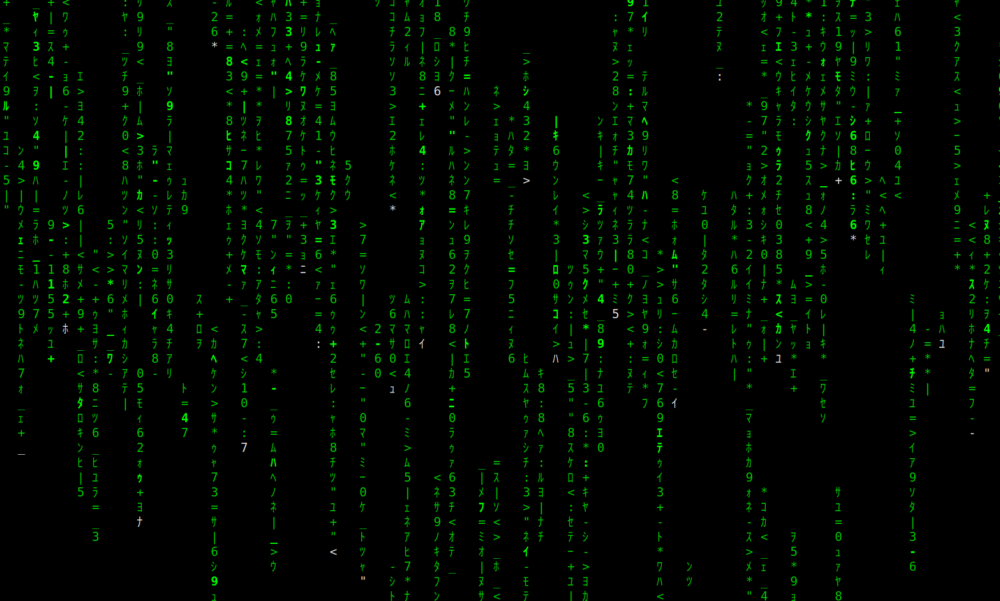

# vikmatrix - Simple matrix lockscreen for ubuntu

``vikmatrix`` allows you to emulate a matrix screen __in each monitor__ while locking your linux session.

The lock screen looks like this: 



## Dependencies

``vikmatrix`` has some dependencies in order to function properly:

### Pyxtrlock

[pyxtrlock](https://github.com/leonnnn/pyxtrlock) is a rewrite of Ian Jackson's great ``xtrlock`` program using
modern libraries, it allows ``vikmatrix`` to have a trasparent and fast lockscreen.

Install [python3-simplepam](https://github.com/leonnnn/python3-simplepam) for
dependencies:
```bash
git clone https://github.com/leonnnn/python3-simplepam.git
cd python3-simplepam
python3 setup.py install
```

Then install ``pyxtrlock``:
```bash
git clone git://github.com/leonnnn/pyxtrlock.git
cd pyxtrlock
sudo python3 setup.py install
```

### Unimatrix

[unimatrix](https://github.com/will8211/unimatrix) is a python script to simulate the display from "The Matrix" in terminal. Uses half-width katakana unicode characters by default, but can use custom character sets. Accepts keyboard controls while running.

Install ``unimatrix`` via:
```bash
sudo curl -L https://raw.githubusercontent.com/will8211/unimatrix/master/unimatrix.py -o /usr/local/bin/unimatrix
sudo chmod a+rx /usr/local/bin/unimatrix
```

### Gnome terminal
Gnome terminal is used to launch a fullscreen terminal in each screen and executing a ``unimatrix`` command.

Vikmatrix installation
---

Once you have installed ``pyxtrlock`` and ``unimatrix`` you can install and launch ``vikmatrix``.

```bash
git clone https://github.com/vjacynycz-stratio/vikmatrix.git
cd vikmatrix
./install.sh
```

The installer creates ``vikmatrix`` symbolic links under /usr/bin. If you move the ``vikmatrix/`` directory, you can update the symbolic links running:
```bash
./install.sh update
```

How it works
----
``vikmatrix`` command executes the following steps:
1. Obtain the number of monitors using ``xrandr``.
2. Extract each hposition.
3. Spawn a gnome-terminal in each one with ``vikmatrixterm``.
4. Lock the screen via ``pyxtrlock``.
5. Wait until unlock to kill ``vikmatrixterm``.

Contributing
----
Feel free to fork and reuse this repo.